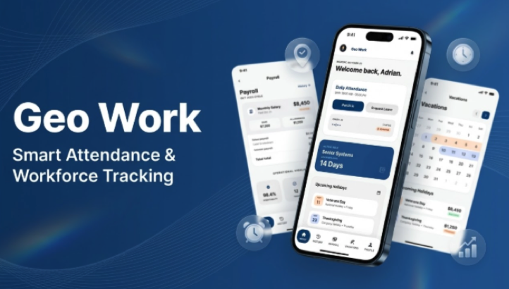
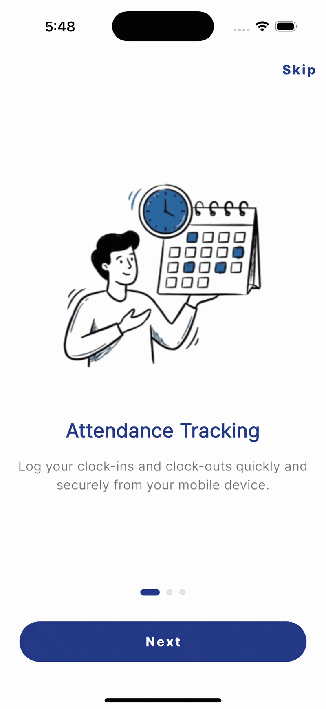
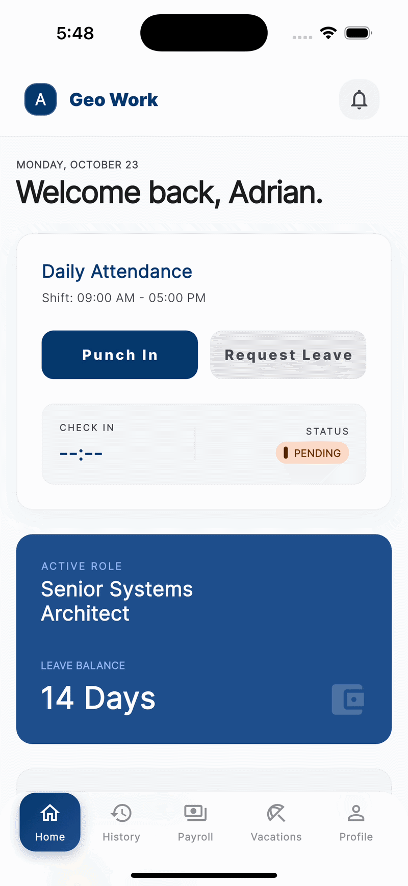
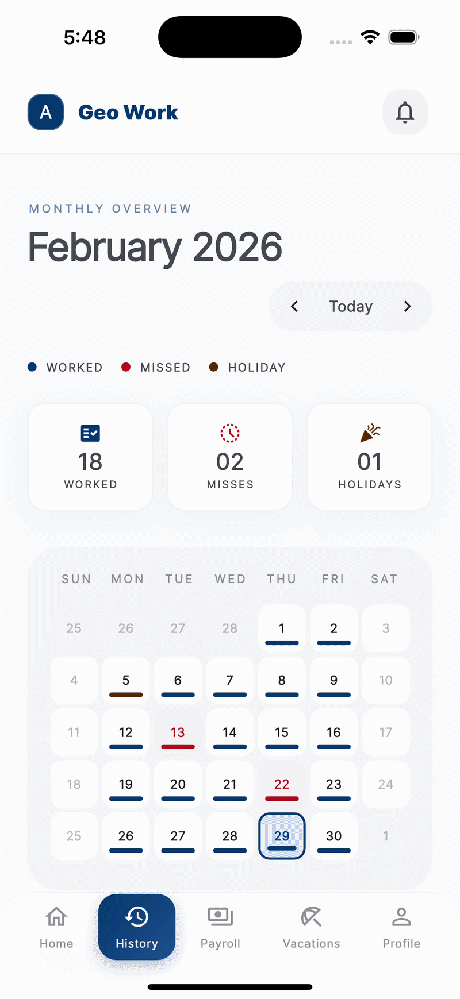

# 🚀 GeoWork

## 📱 Preview



## 🧠 Description

GeoWork is a high-performance corporate mobile application designed to centralize and simplify HR task management. It offers employees a seamless and intuitive experience to manage their work information directly from their mobile devices.

## ⚡ The Problem

Employees often depend on multiple disconnected platforms or slow manual processes to clock in, view paystubs, or request time off. This creates administrative bottlenecks, systematic time loss, and corporate frustration.

## 💡 The Solution

GeoWork transparently centralizes all these operations into a single mobile hub. It provides real-time income visibility, in-app vacation management with approval workflows, and clean attendance tracking, optimizing internal communication and empowering the employee.

## ✨ Key Features

- **Attendance Tracking:** Accurate clock-in and clock-out registration directly from your mobile device.
- **Payroll Management:** Review monthly metrics, earnings, and access your paystubs transparently.
- **Vacation Requests:** Plan and request time off by viewing available days and approval status.
- **Complete History:** Quickly check past events in your work schedule.

## 🛠️ Built With

| Technology       | Description                                                     |
| :--------------- | :-------------------------------------------------------------- |
| **Flutter**      | Google's primary UI SDK for multi-platform development.         |
| **Dart**         | Programming language optimized for user interfaces.             |
| **Bloc / Cubit** | Reactive and decoupled state management.                        |
| **Dio**          | Powerful HTTP client for Dart, used for REST API communication. |
| **GoRouter**     | Modern declarative routing and navigation handling.             |
| **Freezed**      | Code generation for immutable models and type-unions.           |

## 📂 Project Structure

```text
lib/
 └── src/
      ├── backoffice/       # Data layer and business logic
      │    ├── data/        # Network implementations (Dio)
      │    ├── domain/      # Models (Freezed) and entities
      │    └── services/    # API Services (Attendance, Payroll)
      └── presentation/     # UI Layer
           ├── blocs/       # State management with Cubit
           ├── core/        # Route and Theme configuration
           ├── views/       # Main application screens
           └── widgets/     # Reusable UI components
```

## ⚙️ Installation

1. Clone the repository:

```bash
git clone https://github.com/fjsuast/geo-work.git
```

2. Install dependencies:

```bash
flutter pub get
```

3. Generate models and necessary files:

```bash
dart run build_runner build --delete-conflicting-outputs
```

4. Run the application:

```bash
flutter run
```

## 📸 Screenshots

<div align="center">
  <table>
    <tr>
      <td></td>
      <td></td>
      <td></td>
    </tr>
  </table>
</div>

---

Developed with ❤️ by Francisco Suastegui
